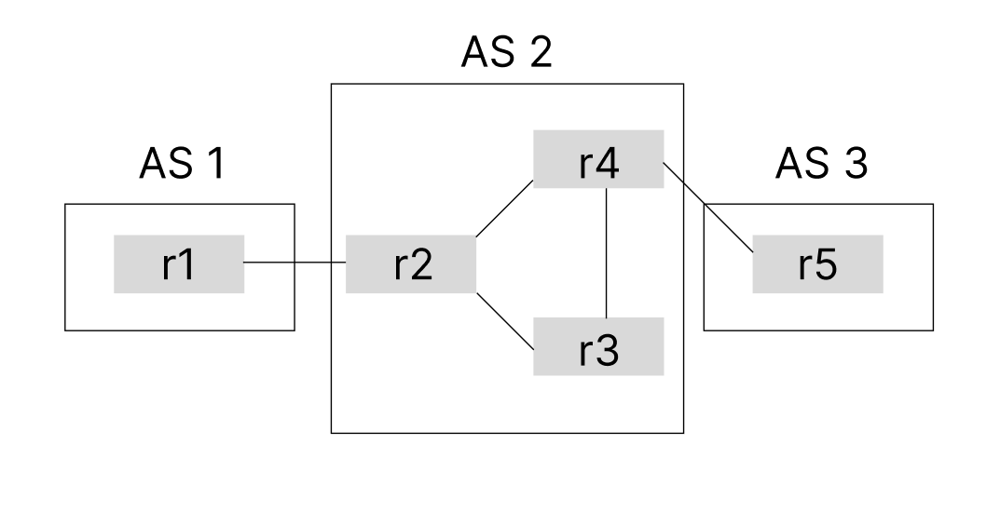
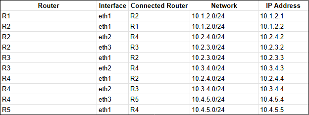
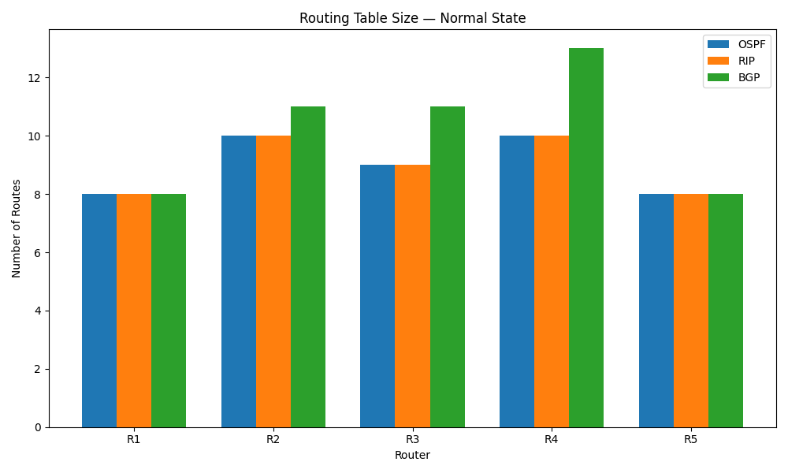
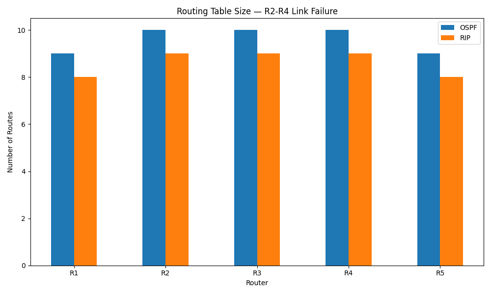
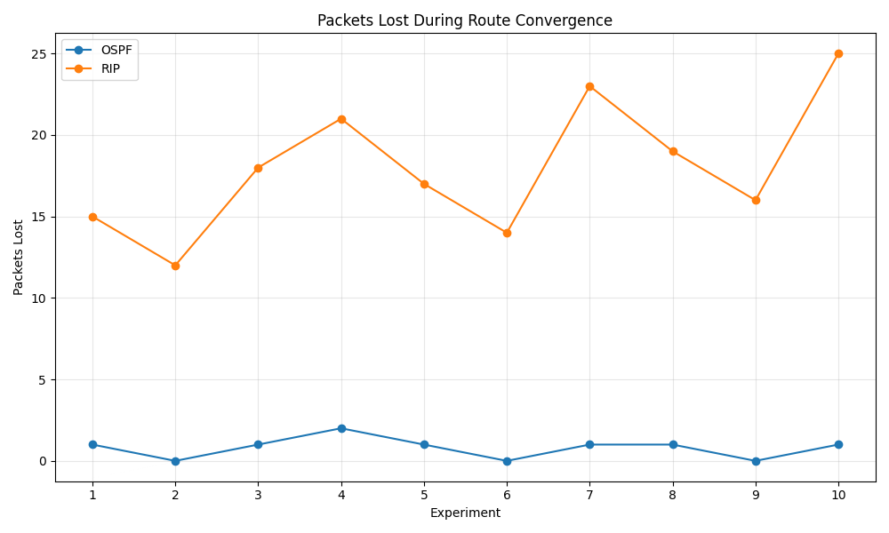

# Ambiente

O ambiente usado foi uma máquina virtual com sistema operacional Linux Mint, versão
22.3, com 4GB de memória e 1 CPU para a realização do experimento.

O laboratório experimental de roteamento foi criado utilizando Containerlab. Cinco containers no total, um container para cada roteador. Os containeres utilizam uma imagem ultra-leve Linux e o software de roteamento BIRD.

O laboratório pode ser reproduzido clonando o repositório e alterando o caminho dos arquivos de configuração do roteador para o protocolo que se deseja usar.

# Topologia

A topologia usada segue abaixo:



Suas redes e conexões:



O objetivo da topologia usada foi simular a conexão entre uma rede doméstica, um ISP e um servidor da Internet.

# Experimento 1

O experimento consistiu em calcular o tamanho das diferentes tabelas de roteamento de cada protocolo em dois cenários.

Cenário 1: todos os roteadores da rede funcionando.

Cenário 2: simulando a falha entre o link do r2 e r4.

O cálculo do tamanho das tabelas veio da quantia de rotas mantidas para cada roteador em cada protocolo utilizando o comando 

````birdc show route count````

em cada roteador.

O gráfico abaixo apresenta o tamanho da tabela no cenário 1:



O gráfico abaixo apresenta o tamanho da tabela no cenário 2:



# Experimento 2

O segundo experimento foi realizado para avaliar a robustez do protocolo na eventual falha de um link da rede.

Pacotes devem trafegar na rede de R1 para R5. A falha de conexão simulada foi a interrupção do link R2 - R4, a melhor rota para a conexão R1 - R5.

O experimento visa calcular o tempo que o protocolo leva para ajustar a sua rota até que a conexão R1 - R5 seja reestabelecida.

O teste realizado foi um ping utilizando o comando

````docker exec clab-bird-uni-lab-r1 ping 10.4.5.5````

E, em seguida, derrubando o link R2 - R4 com o comando 

````docker exec -it clab-bird-uni-lab-r2 ip link set eth2 down````

e verificando a quantidade de pacotes perdidos para estimar o tempo da volta da conexão.

O gráfico abaixo mostra o número de pacotes seguidos perdidos até que a conexão seja reestabelecida:



Como o comando ping envia um pacote por segundo podemos inferir que o tempo aproximado de convergência é o número seguido de pacotes.

# Vídeos

Experimento 2 RIP:

https://drive.google.com/file/d/14jJ5CyLEP4NciN8NY24Diwbt752cCeKL/view?usp=sharing

Experimento 2 OSPF:

https://drive.google.com/file/d/1jPeaozQWHUR5kkXlD090PICDPsOFbK4f/view?usp=drive_link

Experimento 2 BGP:

https://drive.google.com/file/d/15pehRKBMjoRCzYOFgSMGL-3zQWy30YC4/view?usp=drive_link
